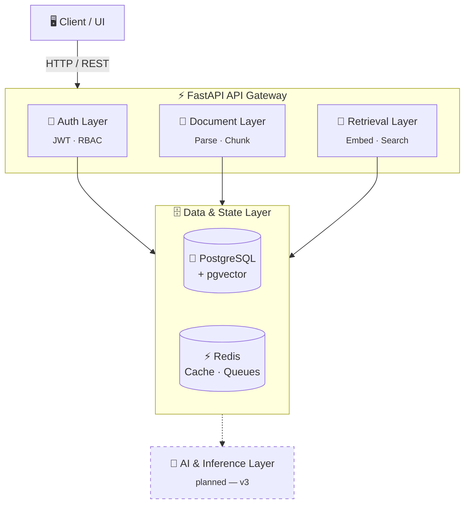

<div align="center">

# 🪨 Quarry

### AI Knowledge Infrastructure Platform

<p>
  
  
  
  
  
  
</p>

<p>
  
  
  
  
</p>

**📌 [Quickstart](#-quickstart) &nbsp;·&nbsp; 🏗️ [Architecture](#-architecture) &nbsp;·&nbsp; 🗺️ [Roadmap](#-roadmap) &nbsp;·&nbsp; 🧰 [Tech Stack](#-tech-stack)**

</div>

<br />

## 📖 Overview

Most AI projects stop at the demo: a single notebook, an in-memory vector store, a script that works once on someone's machine. Quarry is built the other way — as a real backend first, with the model layer added on top of infrastructure that's already production-shaped.

It's a long-running, versioned platform (v1 → v15) rather than a one-off project, covering everything from RAG and agents to evaluation, observability, and inference serving.

**⚖️ How it compares**

| | 🧪 Typical AI demo | 🪨 Quarry |
|---|---|---|
| **Architecture** | Single script / notebook | Tiered, containerized backend |
| **Data layer** | In-memory, ephemeral | PostgreSQL + pgvector, persisted |
| **State / caching** | None | Redis |
| **Testing** | Manual spot-checks | Metric-driven evaluation (planned) |
| **Observability** | `print()` | Structured logging & tracing (planned) |
| **Lifecycle** | Abandoned after a weekend | Versioned roadmap, v1 → v15 |

<br />

## 🏗️ Architecture



**🔄 Request flow:** the client talks to a single FastAPI gateway, which fans out to auth, document processing, and retrieval. All three sit on a shared PostgreSQL + pgvector store for persistence and a Redis layer for caching and queues. The whole stack runs as Docker Compose services today; the inference/LLM layer is the next piece going on top.

<br />

## 🗺️ Roadmap

Quarry evolves as a single platform across 15 versions, grouped into four phases.

```mermaid
flowchart LR
    subgraph P1["🏁 Foundation"]
        v1["v1<br/>Core Backend"]
        v2["v2<br/>Production Backend"]
    end

    subgraph P2["🧠 Intelligence"]
        v3["v3<br/>LLM Layer"]
        v4["v4<br/>Production RAG"]
        v5["v5<br/>Agents"]
        v6["v6<br/>Evaluation"]
    end

    subgraph P3["📈 Scale"]
        v7["v7–v11<br/>Learning · Research ·<br/>Repo Intel · Retrieval · Memory"]
        v12["v12–v13<br/>Guardrails ·<br/>Cloud Ops"]
    end

    subgraph P4["🚀 Platform"]
        v14["v14<br/>Observability"]
        v15["v15<br/>Inference Platform"]
    end

    v1 --> v2 --> v3 --> v4 --> v5 --> v6 --> v7 --> v12 --> v14 --> v15

    classDef done fill:#2ea44f,stroke:#22863a,color:#fff
    classDef active fill:#fb8500,stroke:#d97706,color:#fff
    classDef planned fill:#eee,stroke:#bbb,color:#666

    class v1,v2 done
    class v3 active
    class v4,v5,v6,v7,v12,v14,v15 planned
```



**🟢 Done · 🟠 In progress · ⚪ Planned**

| Phase | Version | Focus | Status |
|---|---|---|---|
| 🏁 Foundation | v1 | Auth, PostgreSQL, PDF parsing, embeddings, retrieval | ✅ Complete |
| 🏁 Foundation | v2 | Redis, pgvector, Docker, multi-container, health checks | ✅ Complete |
| 🧠 Intelligence | v3 | LLM integration, streaming, provider abstraction | 🔶 In progress |
| 🧠 Intelligence | v4 | Hybrid search, re-ranking, advanced RAG | ⬜ Planned |
| 🧠 Intelligence | v5 | Multi-agent orchestration, tool use | ⬜ Planned |
| 🧠 Intelligence | v6 | RAG / agent evaluation framework | ⬜ Planned |
| 📈 Scale | v7–v11 | Fine-tuning, research pipelines, code search, graph RAG, memory | ⬜ Planned |
| 📈 Scale | v12–v13 | Guardrails, PII scrubbing, Kubernetes, CI/CD, Terraform | ⬜ Planned |
| 🚀 Platform | v14 | OpenTelemetry, structured logging, tracing | ⬜ Planned |
| 🚀 Platform | v15 | Custom vLLM serving, inference optimization | ⬜ Planned |

<br />

## ⚙️ Current Capabilities

- 🔐 **Authentication** — JWT-based registration and login
- 📄 **Document processing** — PDF upload, parsing, and chunking via PyMuPDF
- 🧬 **Embeddings** — automated vector generation via Sentence Transformers
- 🔎 **Semantic retrieval** — vector search over stored documents
- 🗄️ **Persistence** — PostgreSQL via SQLAlchemy, with pgvector for embeddings
- 🐳 **Infrastructure** — fully containerized: API, Postgres, and Redis as separate services

**💓 Health check**

```
GET /health
```
```json
{
  "status": "healthy",
  "database": "connected",
  "redis": "connected"
}
```

<br />

## 🧰 Tech Stack

| Layer | Technology |
|---|---|
| 🐍 Language | Python |
| ⚡ API framework | FastAPI |
| 🐘 Database | PostgreSQL |
| 🔎 Vector search | pgvector |
| ⚡ Cache / queues | Redis |
| 🧩 ORM | SQLAlchemy |
| ✅ Validation | Pydantic |
| 🔐 Auth | JWT |
| 📄 Document parsing | PyMuPDF |
| 🧬 Embeddings | Sentence Transformers |
| 🐳 Containerization | Docker / Docker Compose |

<br />

## 📂 Repository Structure

```
quarry/
├── app/
│   ├── api/          # Route handlers and endpoints
│   ├── core/         # Config, security, settings
│   ├── db/           # Sessions and migrations
│   ├── models/       # SQLAlchemy models
│   ├── schemas/      # Pydantic schemas
│   └── services/     # Business logic (auth, docs, vectors)
├── docs/             # Architecture notes
├── scripts/          # Setup and DB utilities
├── tests/            # Unit and integration tests
├── .env.example
├── requirements.txt
└── README.md
```

<br />

## 🚀 Quickstart

### 🐳 With Docker

```bash
docker compose up -d        # start the full stack
docker ps                   # view running services
docker compose down         # stop everything
```

📘 API docs are served at **http://localhost:8000/docs**

### 🛠️ Without Docker

```bash
git clone https://github.com/x2ankit/quarry.git
cd quarry

python -m venv venv
source venv/bin/activate    # Windows: venv\Scripts\activate

pip install -r requirements.txt
cp .env.example .env        # then configure your settings

alembic upgrade head        # requires Postgres running locally or via Docker
uvicorn app.main:app --reload
```

<br />

## 📜 License

This project is open source. See [`LICENSE`](LICENSE) for details.

<br />

<div align="center">

### 👨‍💻 Author

**Ankit Arayan Tripathy**

[](https://github.com/x2ankit)

<br />

<sub>⭐ If Quarry's approach to AI infrastructure resonates with you, consider starring the repo.</sub>

</div>